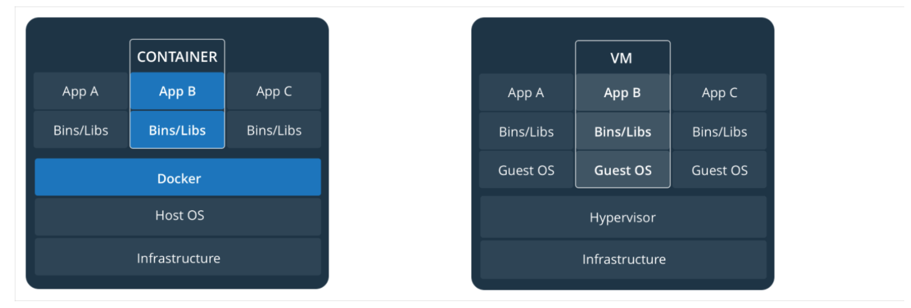
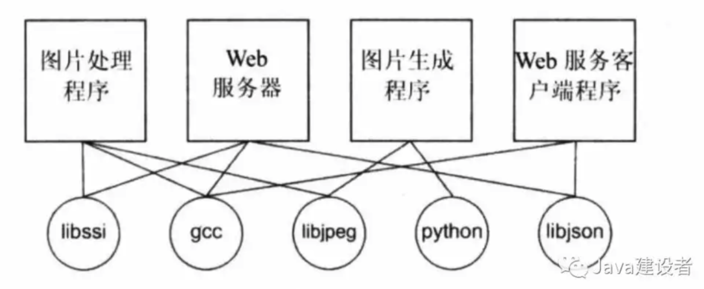
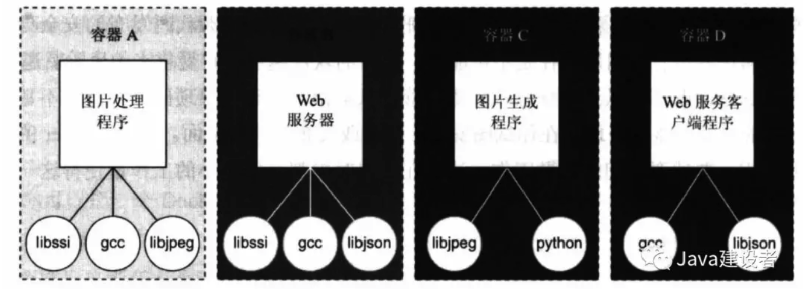
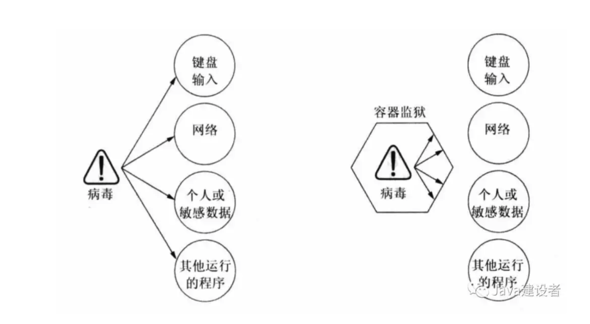

# Docker概述
## 1、什么时Docker
Docker是基于Go语言实现的开源容器项目。Docker是一个为开发者和系统管理员提供的开发，部署和运行的容器应用程序。Linux使用容器开发应用程序的这种方式称为容器化。Docker项目已加入Linux基金会，并遵循Apache2.0 协议，全部开源代码再http://github.com/docker 项目仓库进行维护。
## 2、Docker的基本概念
Docker中包括三个基本概念：容器(Container)、镜像(Image)、仓库(Repository)   
### (1)容器（Container）镜像运行时的实体
先来看看容器较为官方的解释：容器就是将软件打包成基本单元，用来开发、交付和部署。

- 容器镜像是轻量的、可执行的软件包 ，包含软件运行所需的所有内容：代码、运行时环境、系统工具、系统库和设置。
- 容器化软件是基于Linux和Windows的应用，在任何环境中都能够始终如一地运行。
- 容器赋予了软件独立性，使其免受外在环境差异（例如，开发和预演环境的差异）的影响，从而有助于减少团队间在相同环境上运行不同软件时的冲突。
### （2）镜像（Image）--一个特殊的文件系统
Docker中的Image镜像相当于是一个文件系统，除了提供容器运行时所需的程序、库、资源、配置等文件外，还包含了一些为运行时准备的一些配置参数。
### （3）仓库（Repository）--集中存放镜像文件的地方
如果你使用过 git 和 github 就很容易理解Docker的仓库概念。Docker仓库相当于一个 github 上的代码库。
Docker 仓库是用来包含镜像的位置，Docker提供一个注册服务器（Registry）来保存多个仓库，每个仓库又可以包含多个镜像。
它们的范围大小依次是 仓库 > 镜像 > 容器

## 3.虚拟机
容器在Linux上本机运行，并与其他容器共享主机的内核。它运行一个独立的进程，不占用任何其他可执行文件的内存，所以轻量化。  
虚拟机运行一个完成的客户操作系统，通过虚拟机管理程序对主机资源进行虚拟访问。通常，VM提供的环境比大多数应用需要的资源更多。
如图

## 4.虚拟机和容器的比较
1. Docker容器很快，启动和停止可以在秒级实现，这相比传统的虚拟机方式（数分钟）要快得多。
2. Docker容器对系统资源需求很少，一台主机可以运行数千个Docker容器；
3. Docker通过类似Git设计理念的操作来方便用户获取、分发和更新应用镜像，存储复用，增量更新；
4. Docker通过Dockerfile支持灵活的自动化创新和部署机制，以提高工作效率，并标准化流程。
### Docker容器技术与传统虚拟机技术的比较
特性|容器|虚拟机
---|---|---
启动速度|秒级|分钟级
性能|接近原生|较弱
内存代价|很小|较多
硬盘使用|一般为MB|一般为GB
运行密度|单机支持上千个容器|一般为几十个
隔离性|安全隔离|完全隔离
迁移性|优秀|一般

## 5、Docker解决了什么样的问题
- 组织有序：如果没有Docker，一台机器就可能像是一个装满垃圾的抽屉，应用程序依赖各种资源，一些应用程序依赖各种代码库，语音，图像等。这种依赖关系很像分布式各个系统的调用网一样混乱不堪，如果用一张图来表示一下，就像是下面这样

Docker解决了这个问题，应用程序的各种依赖和环境都直接部署在Docker的容器中，起到隔离一切的目 的，就像是下图所示的这样

- 提高可移植性：另一个软件的问题是，应用程序的依赖不仅只是资源的依赖，还有可能是系统环境的依赖，操作系统之间的移植性一直是软件用户的一个主要问题。虽然Linux和OS X之间可能会有某种兼容性，但是在Windows环境下开发的软件移植到Linux会很困难。Docker解决了这一点，因为Docker可运行在原生的Linux环境下，在OS X和Windows环境中通过单独的虚拟机也可以运行。  
这种新的移植性在几个方面有助于用户使用：第一，它将软件以前无法使用的地方彻底解锁。第二，它可以在任何系统上运行相同的软件。第三，软件维护人员可以集中精力在单一平台和一套依赖关系中编写他们的软件，这节省了大量的时间。
- 保护你的机器：Docker就像是物理的牢房，容器里的任何东西只能访问它内部的东西。容器限制了一个程序对其他程序带来的影响范围、可访问的数据和系统资源的影响范围。下图说明了容器内部运行和外部运行软件的区别

